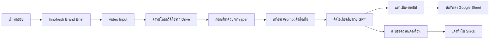

# Innofresh — Clip Factory (Reels & TikTok)

n8n workflow ที่ช่วยคิดไอเดียคลิปสั้นจากวิดีโอต้นฉบับ ถอดเสียงอัตโนมัติ
ให้ AI คิดไอเดีย/hook/แคปชั่น/hashtag ตามบุคลิกแบรนด์ Innofresh แล้วเตรียม
"cut sheet" ลง Google Sheet ให้ทีมรีวิว ก่อนนำไปตัดจริงใน CapCut

**สิ่งที่ระบบนี้ไม่ทำ:** ตัดคลิปวิดีโอจริง และโพสต์ขึ้น Reels/TikTok
เพราะ CapCut ไม่มี public API ให้เชื่อมต่ออัตโนมัติจากภายนอก ขั้นตอนตัดคลิป
และโพสต์ยังต้องทำเองโดยทีมงาน — ระบบนี้แค่เตรียมทุกอย่าง (จุดตัด, ข้อความ,
แคปชั่น) ให้พร้อมที่สุดก่อนเข้า CapCut

## ภาพรวม flow



## ติดตั้งก่อนใช้งาน (ทำครั้งเดียว)

1. **นำเข้าไฟล์** `clip-factory-reels-tiktok.json` เข้า n8n
   (Workflows → Import from File)
2. **แก้ข้อมูลแบรนด์** ใน node `Innofresh Brand Brief` ให้ตรงกับ Innofresh
   จริง — โทนเสียง, กลุ่มเป้าหมาย, คอนเทนต์พิลลาร์, ข้อห้าม, hashtag หลัก
3. **ตั้งค่า credential OpenAI** (ต้องมี API key ที่เปิดใช้ Whisper +
   GPT) ใน node `ถอดเสียงด้วย Whisper` และ `คิดไอเดียคลิปด้วย GPT`
4. **ตั้งค่า credential Google Drive** ใน node `ดาวน์โหลดวิดีโอจาก Drive`
5. **ตั้งค่า credential Google Sheets** ใน node `บันทึกลง Google Sheet`
   แล้วเลือก Spreadsheet + sheet ปลายทาง — สร้างชีตใหม่โดยใส่หัวคอลัมน์
   แถวแรกตามนี้ (ต้องตรงชื่อ เพราะ node ใช้ auto-map ตามชื่อ field):

   ```
   clipNumber | videoTitle | googleDriveFileId | brandName | platform |
   hook | caption | hashtags | suggestedStart | suggestedEnd | reason |
   status | capcutInstructions
   ```

6. **Slack แจ้งเตือน (ถ้าใช้)**: เอา Slack Incoming Webhook URL มาใส่ใน
   node `แจ้งทีมใน Slack` (ช่อง URL) — ถ้าไม่ใช้ Slack ให้ลบ node
   `สรุปข้อความแจ้งเตือน` และ `แจ้งทีมใน Slack` ออก หรือเปลี่ยนเป็น node
   แจ้งเตือนช่องทางอื่น (เช่น Email/LINE Notify)

## ใช้งานแต่ละครั้ง

1. อัปโหลดวิดีโอต้นฉบับขึ้น Google Drive แล้วคัดลอก File ID
2. กด **Execute workflow** แล้วแก้ค่าใน node `Video Input`:
   `videoTitle`, `googleDriveFileId`, `sourceNotes`
3. รอระบบถอดเสียง → คิดไอเดีย → บันทึกลง Google Sheet (และแจ้งใน Slack
   ถ้าตั้งค่าไว้)
4. ทีมเปิด Google Sheet เพื่อรีวิว/แก้ไขไอเดีย ก่อนส่งต่อ

## ขั้นตอนตัดคลิปจริง (ทำใน CapCut)

สำหรับแต่ละแถวใน Google Sheet ที่รีวิวผ่านแล้ว:

1. เปิด CapCut แล้วนำเข้าไฟล์วิดีโอต้นฉบับ (ตาม `videoTitle` /
   `googleDriveFileId`)
2. ตัดช่วงตาม `suggestedStart` – `suggestedEnd` (วินาที)
3. ใส่ข้อความ hook ในช่วง 1-2 วินาทีแรกตามคอลัมน์ `hook`
4. Export แล้วโพสต์ตาม `platform`, `caption`, `hashtags` ที่เตรียมไว้
5. อัปเดตคอลัมน์ `status` ในชีตเป็น `Posted` เพื่อติดตามสถานะ

## ข้อจำกัด / จุดที่ควรตรวจก่อนใช้จริง

- **CapCut ไม่มี API** — ส่วนตัดคลิปและโพสต์เป็น manual ทั้งหมด นี่คือ
  ข้อจำกัดของ CapCut เอง ไม่ใช่ของ workflow นี้
- Node `ถอดเสียงด้วย Whisper` แนบไฟล์วิดีโอแบบ multipart form-data —
  ถ้า field แนบไฟล์ไม่ทำงาน ให้เปิด node แล้วเลือก binary field เป็น
  `data` ใหม่อีกครั้ง
- ไฟล์วิดีโอต้นฉบับควรมีขนาดไม่เกินลิมิตของ OpenAI Whisper API (25MB) —
  ถ้าไฟล์ใหญ่กว่านี้ต้องบีบอัด/ตัดสั้นลงก่อน
- โมเดล GPT ที่ตั้งไว้คือ `gpt-4o` ใน node `คิดไอเดียคลิปด้วย GPT` —
  เปลี่ยนได้ตามต้องการ (แก้ค่า `model` ใน jsonBody)

## แนวทางขยายในอนาคต

- เปลี่ยน trigger จาก `เริ่มทดสอบ` (Manual Trigger) เป็น
  **Google Drive Trigger** เพื่อให้รันอัตโนมัติทุกครั้งที่มีวิดีโอใหม่เข้า
  โฟลเดอร์ที่กำหนด
- เพิ่ม node เช็คความยาว/ขนาดไฟล์ก่อนส่งเข้า Whisper
- เปลี่ยนช่องทางแจ้งเตือนจาก Slack เป็นช่องทางที่ทีมใช้จริง (LINE, Email)
